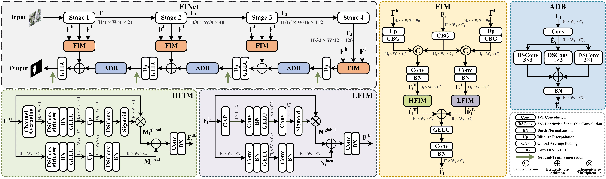
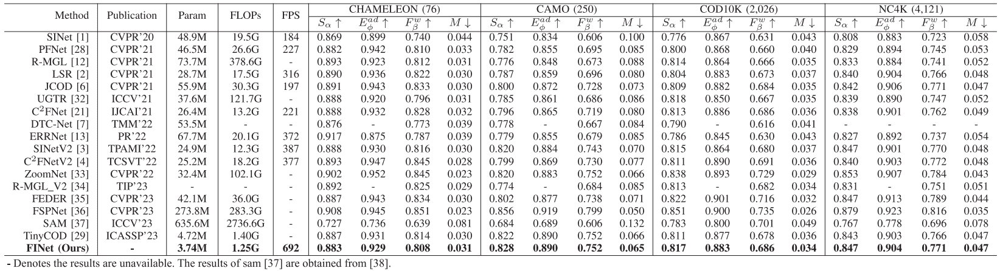
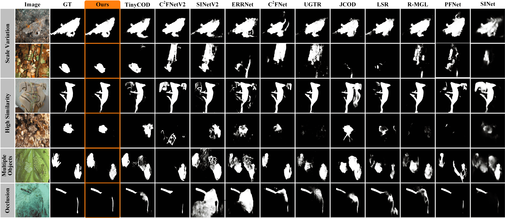

# FINet: Frequency Injection Network for Lightweight Camouflaged Object Detection (IEEE-SPL 2024)

> **Authors:** 
> Weiyun Liang,
> Jiesheng Wu,
> Yanfeng Wu,
> Xinyue Mu,
> and Jing Xu.

## 1. Overview

- This repository provides code for "_**FINet: Frequency Injection Network for Lightweight Camouflaged Object Detection**_" IEEE SPL 2024. [Paper](https://ieeexplore.ieee.org/document/10409558) 

### 1.1. Introduction

 Existing camouflaged object detection (COD) methods typically have large model parameters and computations, hindering their deployment in real-world applications. Although using lightweight backbones can help alleviate this problem, their weaker feature representation often leads to performance degradation. To address this issue, we observe that frequency information has shown effective for cumbersome networks, but its effectiveness for lightweight ones has not been thoroughly investigated. Biological studies indicate that the human visual system utilizes distinct neural pathways to respond to different frequency stimuli, contributing to specialization and efficiency. Motivated by this, we propose an efficient frequency injection module (FIM) to aid lightweight backbone features by separately injecting detailed high frequency and object-level low frequency cues at each stage. FIM can be used as a plug-and-play component in existing COD networks to enhance backbone features at a low cost. With FIM, our proposed frequency injection network (FINet) achieves competitive performance against most state-of-the-art methods with much faster speed (692FPS for the input size of 384×384) and fewer parameters (3.74 M).

### 1.2. Framework

      
    <em> 
    Figure 1: Overall architecture of the proposed FINet, which comprises two components: frequency injection module (FIM) and asymmetric decoder block (ADB). The FIM mainly consists of two modules: high frequency injection module (HFIM) and low frequency injection module (LFIM).
    </em>

### 1.3. Quantitative Results

      
    <em> 
    Figure 2: Quantitative Comparison.
    </em>

### 1.4. Qualitative Results

      
    <em> 
    Figure 3: Qualitative Comparison.
    </em>

## 2. Proposed Baseline

### 2.1. Prepare the Data

The training and testing datasets can be downloaded from https://github.com/GewelsJI/SINet-V2/tree/main .

You can modify `config.py` to set all the data paths. Here is an example of a setup:

1. Put the training data in folder `./data/TrainDataset`, and put the testing data in folder `./data/TestDataset`.

2. `TrainDataset` should contain two folders: `Imgs` and `GT`. 

3. `TestDataset` should contain four folders: `CHAMELEON`, `CAMO`, `COD10K`, and `NC4K`. Each of the four folders contains two sub-folders: `Imgs` and `GT`.

### 2.2 Training Configuration

Traning hyperparameters and data paths can be modified in `config.py`.

### 2.3 Training, Inference, and Testing

+ Run `train.py` to train the model.

+ Run `inference.py` to generate the prediction maps. Set path to your trained checkpoint (`pth_path`).

+ Run `evaluate.py` to calculate the evaluation metrics for the prediction maps. Set path to your predictions (`pred_path`).

## 3. Pre-computed Maps and Trained Weights

+ Pre-computed Maps: [FINet (EfficientNet-B0)](), [FINet (TinyNet-A)]()

+ Trained Weights: [FINet (EfficientNet-B0)](), [FINet (TinyNet-A)]()

## 4. Citation

Please cite our paper if you find the work useful, thanks!
	
    @ARTICLE{10409558,
        author={Liang, Weiyun and Wu, Jiesheng and Wu, Yanfeng and Mu, Xinyue and Xu, Jing},
        journal={IEEE Signal Processing Letters}, 
        title={FINet: Frequency Injection Network for Lightweight Camouflaged Object Detection}, 
        year={2024},
        volume={31},
        pages={526-530},
        doi={10.1109/LSP.2024.3356416}
    }

    
**[⬆ back to top](#1-overview)**
